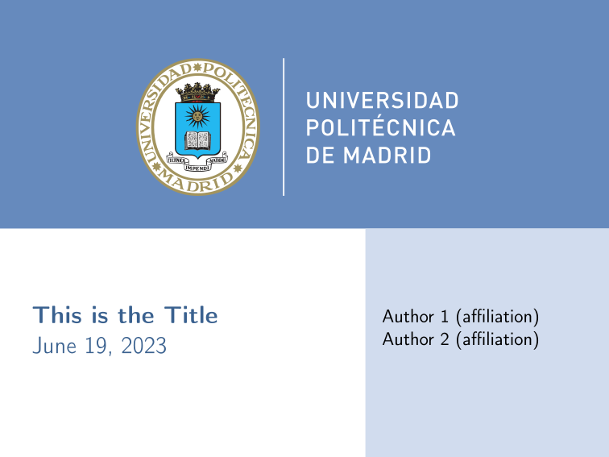
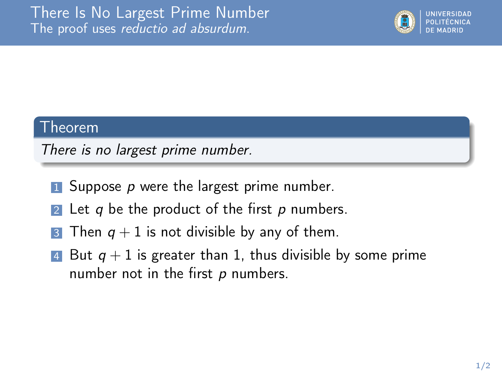
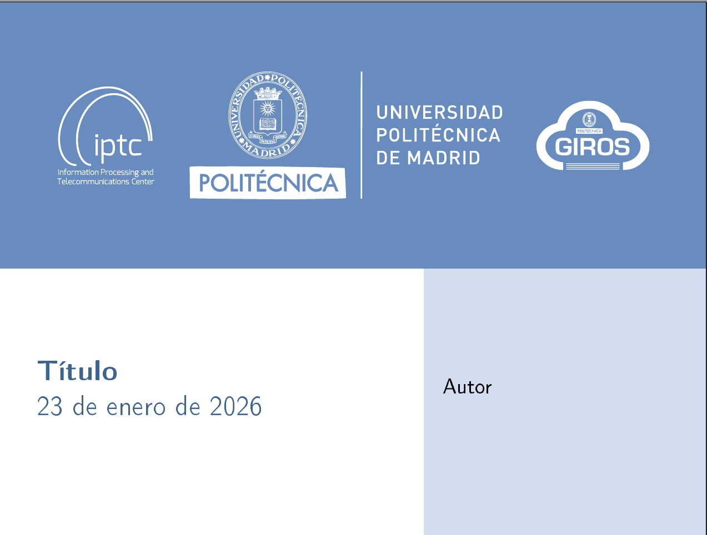
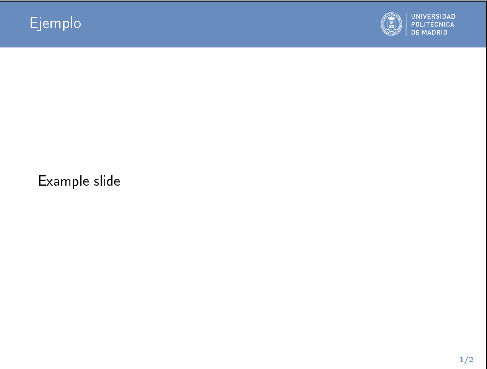

# beamer-upm
Simple UPM template for beamer based on Carlo Fiandrino tutorial:
  https://tex.stackexchange.com/a/146682/62559

Just include all files from this folder along your `.tex` with `\usetheme{upm}`. To avoid numbering title slide, use:
```tex
...
\begin{frame}
  \titlepage
\end{frame}
\setcounter{framenumber}{0}
...
```

### GIROS-IPTC slides
The template shows the logos of
GIROS
and
IPRC
in the cover slide if you write
```tex
\usetheme[girosiptc]{upm}
```

# Slides' images



With `\usetheme[girosiptc]{upm}`


